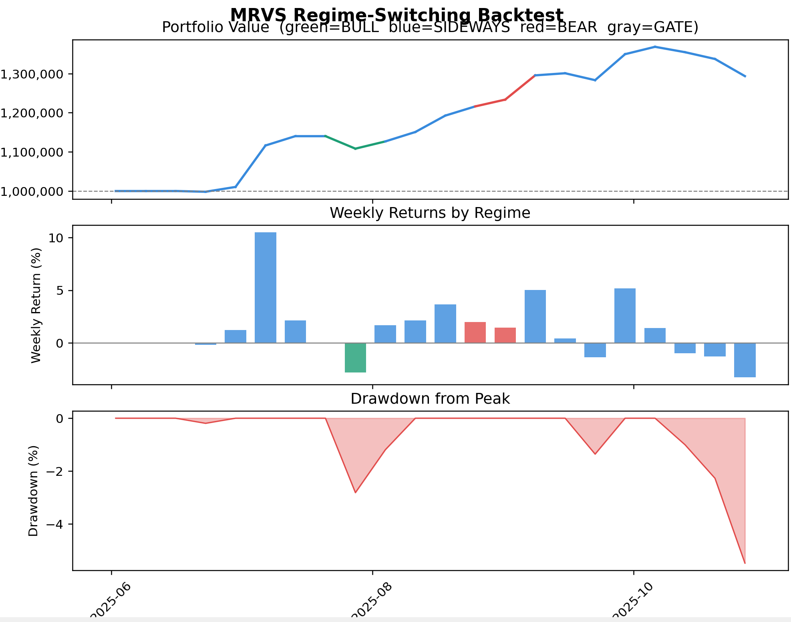
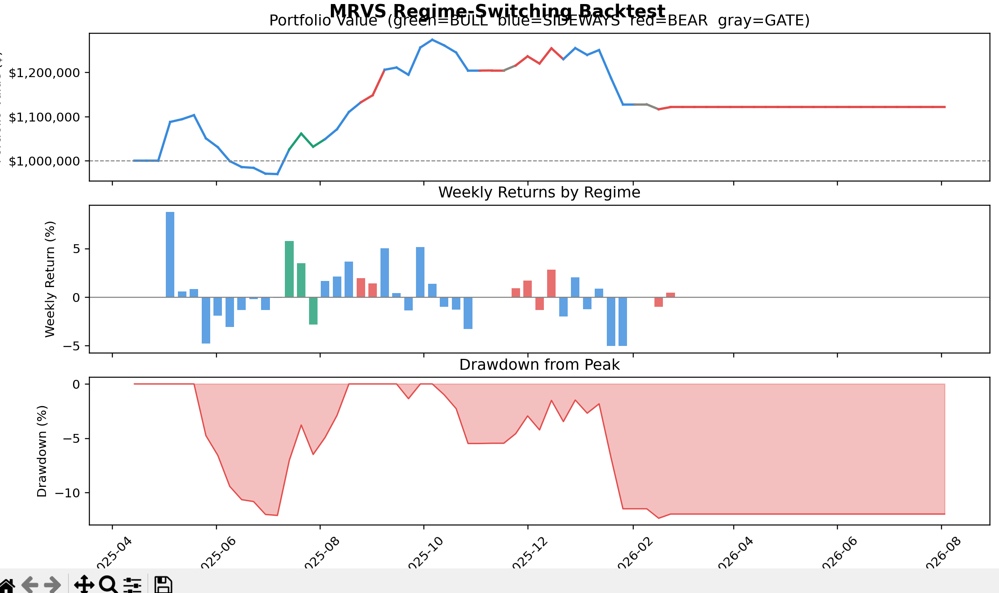
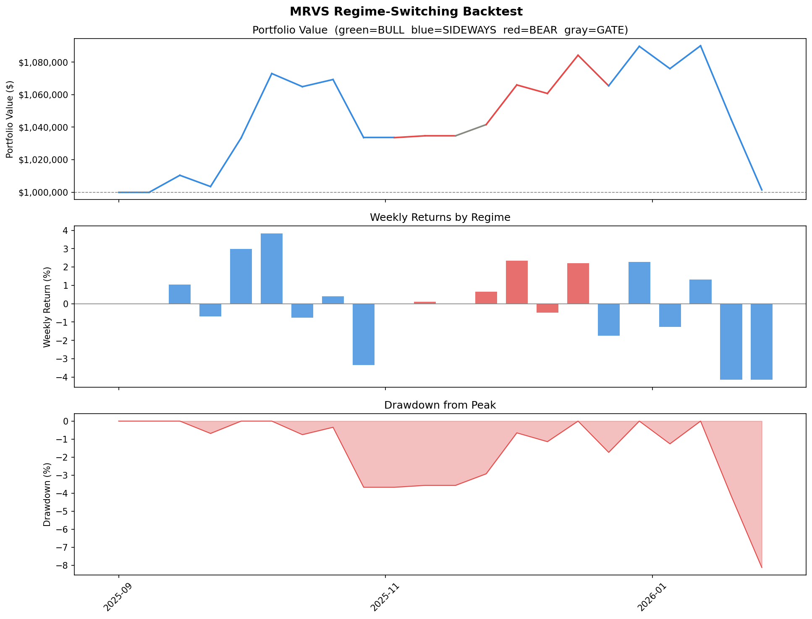

# Setup

0. Enter virtual env (optional)

```py
python -m venv venv # init
./venv/Scripts/activate
```

1. Install libraries

```bash
pip install -r requirements.txt
```

2. Fill .env variables (copy .env.example)

```
ROOSTOO_API_KEY=
ROOSTOO_SECRET=

TELEGRAM_BOT_TOKEN=
TELEGRAM_CHANNEL_ID=
TELEGRAM_TOPIC_ID=
INITIAL_CAPITAL=
```

2. Run backtest

```bash
py download_data --start <start_date YYYY/MM/DD> --end <end_date YYYY/MM/DD> # this will create a data folder in the base directory
py backtest.py --start <start_date YYYY/MM/DD> --end <end_date YYYY/MM/DD> --data <data_folder>
```

3. Run bot

```bash
py bot.py
```

# MRVS — Momentum-Reversal-Variance Sizing

### Regime-Switching Crypto Trading Strategy

A quantitative long-only trading bot that adapts its strategy based on the current market regime. Built for the SG vs HK University Web3 Quant Hackathon on the Roostoo mock exchange.

---

## Strategy Overview

The core insight driving this strategy is that **no single approach works across all market conditions**. Momentum strategies underperform in sideways markets. Mean-reversion strategies miss big bull runs. This bot detects the current regime every Monday and switches its entry logic, position sizing, and exit rules accordingly.

```
Every Monday morning:
  ┌─────────────────────────────────────────────────────┐
  │  Classify regime using BTC 20-day return + 50d MA   │
  └────────────┬──────────────┬──────────────┬──────────┘
               │              │              │
            BULL           SIDEWAYS        BEAR
         Breakout         Mean-rev      Defensive
         playbook         playbook       playbook
```

---

## Regime Detection

Runs every Monday using BTC daily candles before any trades are placed.

| Regime        | Condition                                     | Weekly Action                     |
| ------------- | --------------------------------------------- | --------------------------------- |
| **BULL**      | BTC 20d return > +8% AND price > 50d MA       | Full deployment, breakout entries |
| **SIDEWAYS**  | Neither bull nor bear                         | Mean-reversion on red days        |
| **BEAR**      | BTC 20d return < −8% OR price < 50d MA by >5% | Defensive, relative-strength only |
| **BEAR_GATE** | BTC 7d return < −10%                          | Sit out entirely, hold cash       |

---

## Playbook: SIDEWAYS _(mean reversion)_

Best for ranging, consolidating markets where prices oscillate without trend.

**Coin selection** — rank universe by 7-day return, buy top 3 coins, filter out any with RSI > 70 (overbought in a flat market = likely to reverse down, not up).

**Entry** — wait for a red daily close Mon–Wed (daily reversal discount from Wen et al. 2022). Fall back to Thursday open if no red day occurs.

**Parameters**

- Positions: 3
- Hard stop: −5% (checked against hourly low)
- Trailing stop: activates once up 5%, trails 4% below peak
- Take-profit: +15% (1:3 RR)
- RSI early exit: close if RSI > 75 and position up > 3%

**Research basis** — Dobrynskaya (2021) mean-reversion at 1-month+ horizon; BTC-neutral residual mean reversion (Sharpe ~2.3 post-2021 sideways regime).

---

## Playbook: BULL _(momentum breakout)_

Best for trending markets where momentum continues for 1–2 weeks.

**Coin selection** — find coins hitting a new 10-day high. Sort by breakout strength (how far above the prior high). RSI allowed up to 80 — in a bull market, overbought simply means strong.

**Entry** — Monday open (breakout confirmed on signal day, enter immediately at open to capture the momentum).

**Parameters**

- Positions: 3
- Hard stop: −7% (wider — gives momentum room to breathe)
- Trailing stop: activates once up 8%, trails 5% below peak
- Take-profit: **DISABLED** — let winners run in bull markets
- Size floor raised to 0.5× base — be bolder when conditions are right

**Research basis** — Dobrynskaya (2021) positive momentum dominant at 1–2 week horizon; Liu et al. (2021) ~3% gross weekly alpha on long leg of top-decile momentum.

---

## Playbook: BEAR _(relative-strength defensive)_

Best for downtrending markets where capital preservation is the priority.

**Coin selection** — rank coins by **relative strength vs BTC** over the prior 14 days. A coin with −5% return when BTC dropped −15% has RS of +10% — it's "holding up." These coins are most likely to bounce when the market stabilises. RSI guard tightened to 65.

**Entry** — same red-day entry as sideways, but with smaller positions and faster exits.

**Parameters**

- Positions: 2 (more selective)
- Hard stop: −4% (tightest — capital preservation)
- Trailing stop: activates once up 4%, trails 3% below peak
- Take-profit: +8% (2:1 RR — take profits quickly before the next leg down)
- Size cap at 1.0× — never exceed base allocation in bear

**Research basis** — Momentum crash literature (Grobys 2025); optimal timing of long-only exposure in bear markets.

---

## Position Sizing

All three playbooks use **inverse-variance sizing** (Moreira & Muir 2017):

```
position_size = base_allocation × clip(target_variance / realized_variance, floor, cap)
```

- `target_variance` = 0.0025 (≈5% weekly σ, BTC long-run average)
- `realized_variance` = sum of squared daily log-returns over prior 5 days
- When last week was calm → size up. When it was volatile → size down.
- Result: naturally smaller positions entering the weeks most likely to blow up.

---

## Risk Management

Three independent layers of protection, all checked against **hourly candle** data (not just daily closes):

```
Layer 1 — Per-position hard stop
  Checked against hourly LOW every hour
  Exits at the exact stop price, not the next close

Layer 2 — Trailing stop
  Activates once position gains enough (regime-dependent threshold)
  Trails below the highest hourly HIGH since entry
  Prevents winners from becoming losers

Layer 3 — Portfolio stop
  Checked at end of each trading day (23:00 candle)
  If total portfolio value < peak × (1 − 12%), liquidate everything
  Directly protects the Calmar ratio
```

---

## Data & Execution

**Data source** — Binance Data Vision (public, no API key required)

- 1-hour OHLCV klines downloaded via monthly zip files
- Signals computed on daily candles (resampled from hourly)
- Stops and take-profits checked against hourly high/low

**Signal vs execution split**

| Layer                     | Timeframe    | Why                      |
| ------------------------- | ------------ | ------------------------ |
| Regime detection          | Daily        | Stable, not noisy        |
| Momentum / RSI / variance | Daily        | Consistent with research |
| Entry timing (red day)    | Daily close  | Clean signal             |
| Stop-loss trigger         | Hourly low   | Catches intraday wicks   |
| Take-profit trigger       | Hourly high  | Catches intraday spikes  |
| End-of-week exit          | Friday 23:00 | Clean weekly cycle       |

**Fees** — 0.05% maker (limit orders preferred) / 0.10% taker

---

## Files

```
├── backtest.py        Main strategy + backtester
├── download_data.py   Fetches 1h klines from Binance Data Vision
├── weekly_results.csv Output: weekly PnL, capital, regime per week
├── trade_log.csv      Output: every buy/sell with trigger reason
└── backtest_results.png  Output: equity curve, weekly returns, drawdown
```

### Setup

```bash
pip install pandas numpy requests tqdm matplotlib

# Download data (re-run to get fresh hourly candles)
python download_data.py --start 2023-01-01 --end 2025-03-31

# Run backtest
python backtest.py --start 2023-01-01 --end 2025-03-31
```

### Key parameters to tune (top of `backtest.py`)

| Parameter            | Default | Effect                                        |
| -------------------- | ------- | --------------------------------------------- |
| `bull_return_thresh` | 0.08    | How strong BTC must be to trigger BULL regime |
| `bear_return_thresh` | −0.08   | How weak BTC must be to trigger BEAR regime   |
| `bear_weekly_gate`   | −0.10   | Weekly crash threshold to sit out entirely    |
| `sw_position_stop`   | 0.05    | Sideways hard stop (−5%)                      |
| `bull_position_stop` | 0.07    | Bull hard stop (−7%)                          |
| `bear_position_stop` | 0.04    | Bear hard stop (−4%)                          |
| `sw_rr_ratio`        | 3.0     | Sideways TP multiplier (3× stop = +15%)       |
| `bear_rr_ratio`      | 2.0     | Bear TP multiplier (2× stop = +8%)            |
| `portfolio_stop`     | 0.12    | Portfolio-level liquidation threshold (−12%)  |

---

## Backtesting Results

- Sideways Market (the best outcome, since we're targeting the sideways/bearish market of crypto @ Mar 2026).
  01 Jun 2025 - 01 Nov 2025



- Bullish Market (limited upside, worse than buy and hold, but still captured some)
  10 Apr 2025 - 11 Oct 2025



- Bearish Market (When BTC crashed -30%, we got protected using the strategies).
  26 Oct 2025 - 01 Feb 2026



---

## Research Sources

| Layer                                | Paper                                                                |
| ------------------------------------ | -------------------------------------------------------------------- |
| 1–2 week momentum signal             | Dobrynskaya (2021) _Cryptocurrency Momentum and Reversal_            |
| Daily reversal entry timing          | Wen et al. (2022) _Intraday Return Predictability in Crypto_         |
| Variance-based position sizing       | Moreira & Muir (2017) _Volatility-Managed Portfolios_                |
| Momentum crash protection            | Grobys et al. (2025) _Cryptocurrency Momentum Has (Not) Its Moments_ |
| Cross-sectional mean reversion       | Cakici et al. (2022) _ML and the Cross-Section of Crypto Returns_    |
| Bear market relative strength        | Optimal Market-Neutral Multivariate Pair Trading (arXiv 2024)        |
| RSI effectiveness in ranging markets | _Effectiveness of RSI Signals in Timing Crypto_ (PMC 2023)           |
